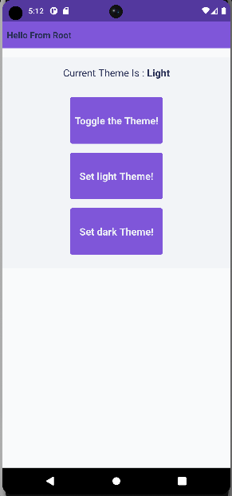

# Reactive styles in React Native example

| Light Theme                                                 |                        Dark Theme                         |
| :---------------------------------------------------------- | :-------------------------------------------------------: |
|  |  |

## Overview

The example project contains the following:

- `ThemeInterface` for defining the Theme
- `DefaultLightTheme` and `DefaultDarkTheme` as Theme variations
- `ThemeContext` for poviding and managing the Theme
- `ThemeAwareObjectHook` for reusing the creation logic of reactive Style objects
- `Card` component for consuming and updating the Theme
- `RenderCounter` for counting the number of renders
- Other components (`ScreeenView`, `Toolbar`) for consuming the Theme

## How to run

Install dependencies:

```
npm install
```

Run Android:

```
npm run android
```

Run iOS:

```
npm run ios
```
